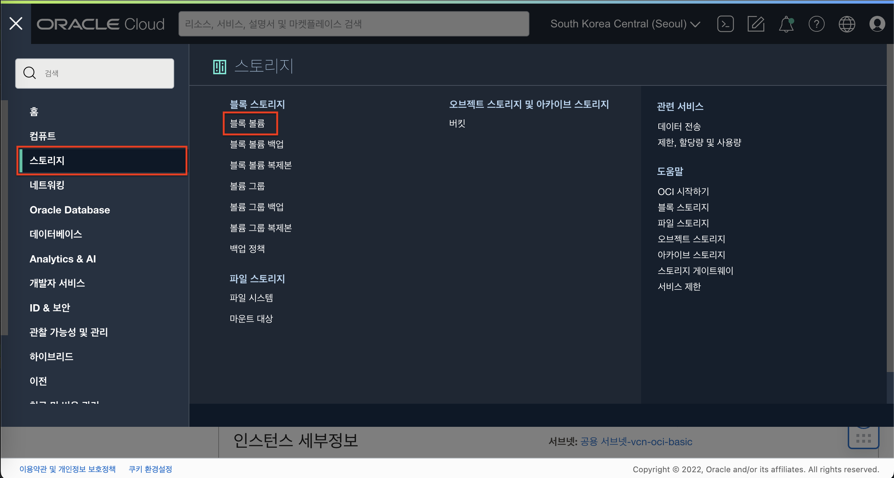
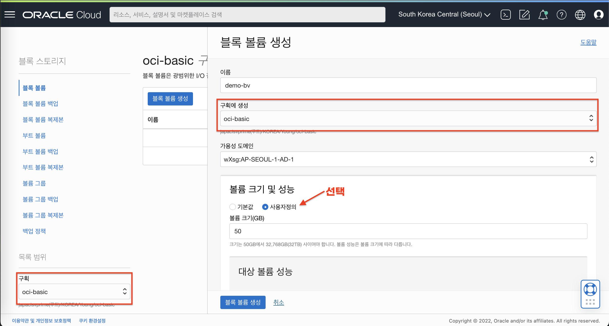
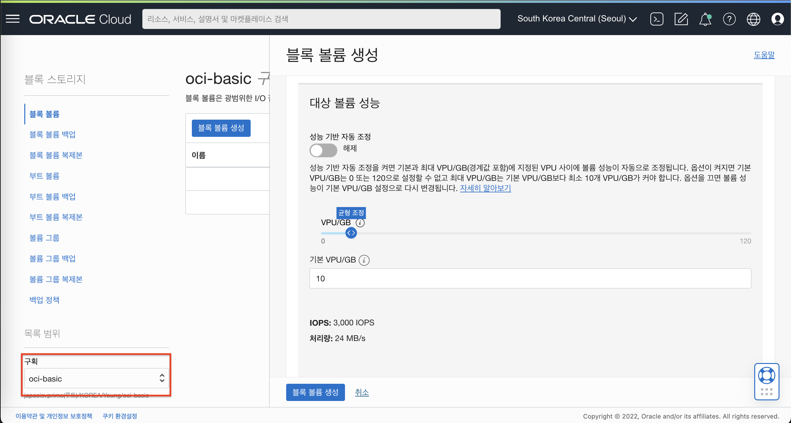
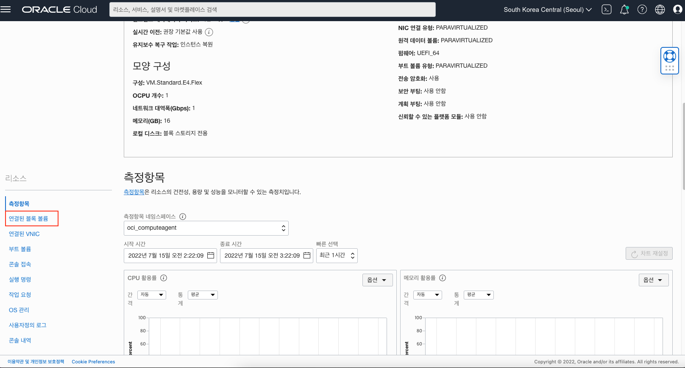
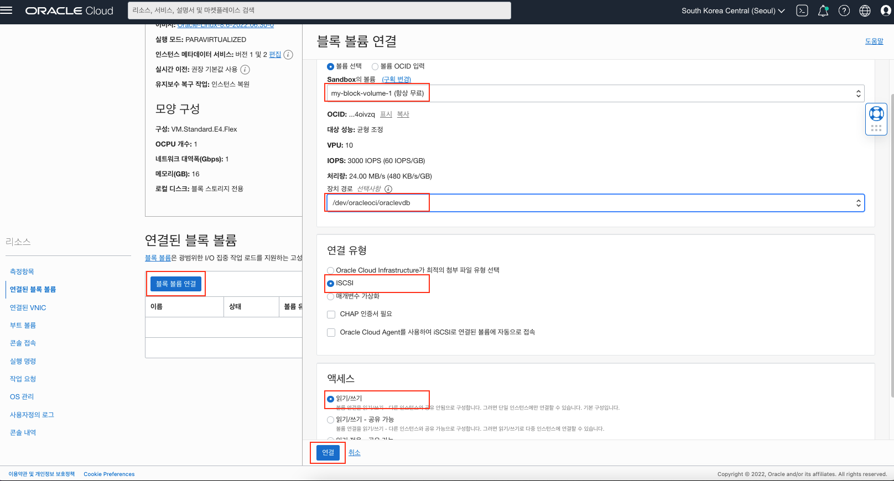
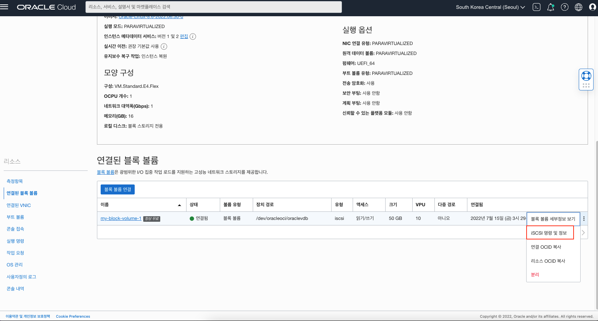
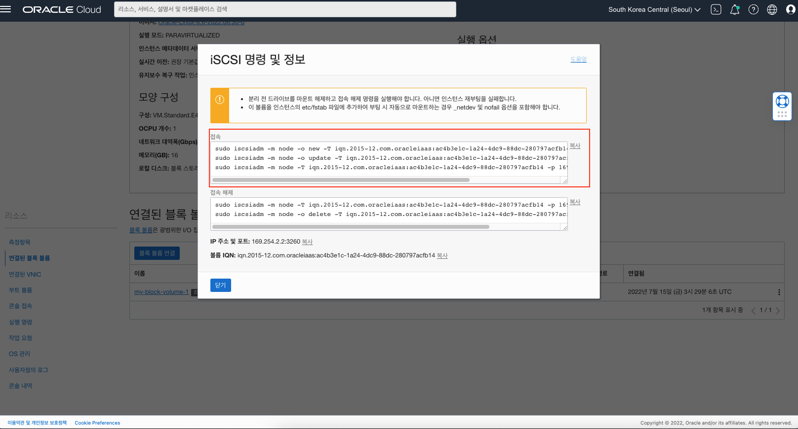

# Block Volume 생성 및 연결하기

## 소개

블록 볼륨 은 Oracle Cloud Infrastructure 컴퓨트 인스턴스에 사용할 수 스토리지입니다. 볼륨을 생성, 연결(Attach) 및 인스턴스에 탑재(Mount)한 후에는 인스턴스에서 물리적인 하드 드라이브처럼 사용할 수 있습니다. 볼륨은 한 번에 하나의 인스턴스에 연결할 수 있지만, 기존 인스턴스에서 볼륨을 분리하고 데이터를 유지한 상태에서 다른 인스턴스에 연결을 할 수 있습니다.
이 실습에서는 볼륨을 생성하고 인스턴스에 연결한 다음 해당 볼륨을 인스턴스에 연결하는 방법에 대해 학습합니다.

소요시간: 20 minutes

### 목표

- OCI 블록볼륨에 대한 이해

### 사전 준비사항

1. 실습을 위한 노트북 (Windows, MacOS)
1. Oracle Free Tier 계정

## Task 1: 블록 볼륨(Block Volume) 생성

1. 좌측 상단의 **햄버거 아이콘**을 클릭하고, **스토리지**을 선택한 후 **블록 볼륨**을 클릭합니다.
   
2. 다음과 같이 입력 및 선택합니다.
   * 이름 (Name): my-block-volume-1
   * 구획에 생성 (Create In Compartment): oci-basic
   * 가용성 도메인 (Availability Domain): 데이터센터를 선택합니다. (서울은 1개)
   * 볼륨 크기 및 성능 (Volume Size and Performance)
       * 사용자정의 선택 (Custom)
       * 볼륨 크기(GB) (Volume Size (in GB)) : 50
       * 대상 볼륨 성능 (Target Volume Performance): VPU (Volume Performance Units)값으로 10
           * VPU에 대한 자세한 정보는 [https://docs.oracle.com/en-us/iaas/Content/Block/Concepts/blockvolumeperformance.htm](https://docs.oracle.com/en-us/iaas/Content/Block/Concepts/blockvolumeperformance.htm) 에서 확인
   * 성능 자동 조정 (Auto-tune Performance): 설정 (On)
       * 성능 자동 조정은 해당 볼륨이 분리된 상태에서는 가장 낮은 성능 옵션으로 자동 변경되어 비용이 절감됩니다. 다시 연결되면 이전에 설정된 성능 옵션으로 자동 조정됩니다.
   * 백업 정책 (Backup Policies): 선택하지 않음
       * 백업 정책을 설정하면 특정 시점에 자동으로 Object Storage에 백업이 이뤄집니다. 백업 정책 기본 Gold (가장 빈번하게 백업 발생), Silver, Bronze 정책이 제공되며, 사용자가 임의로 정의할 수 있습니다.
   * 영역 간 복제 (Cross Region Replication): 해제 (OFF)
       * 영역 간 복제는 현재 블록 볼륨을 생성하는 리전과 매핑되는 리전으로 자동 비동기 복제를 하는 기능입니다.
       * 영역 간 복제에 대한 설명과 매핑된 리전은 [https://docs.oracle.com/en-us/iaas/Content/Block/Concepts/volumereplication.htm](https://docs.oracle.com/en-us/iaas/Content/Block/Concepts/volumereplication.htm)에서 확인할 수 있습니다.
   * 암호화 (Encryption): Encrypt using Oracle-managed keys (기본 설정 유지)

미지막으로 **블록 볼륨 생성 버튼 (Create Block Volume)**을 클릭합니다.




## Task 2: 인스턴스에 블록 볼륨 연결 (Attach & Connect)
iSCSI 방식으로 볼륨을 인스턴스에 연결해보도록 하겠습니다. 메뉴에서 **컴퓨트 (Compute) > 인스턴스 (Instances)**를 차례로 선택한 후에 앞서 생성한 인스턴스를 선택합니다. 인스턴스 상세 페이지에서 아래와 같이 좌측 **리소스 (Resources)** 메뉴에서 **연결된 블록 볼륨 (Attached block volumes)**을 선택합니다.



**블록 볼륨 연결 (Attach block volume)**버튼을 클릭하고 다음과 같이 입력/선택 합니다.
* **블록 볼륨 선택 (Select volume):** 앞서 생성한 블록 볼륨을 선택합니다.
* **장치 경로 (Device path):** 목록중에서 하나를 선택합니다. (/dev/oracleoci/oraclevdb)
* **연결 유형 (Attachment type):** ISCSI
* **액세스 (Access):** 읽기/쓰기(Read/write)



연결을 클릭합니다.

이제 iSCSI 연결을 구성할 수 있습니다. 우선 **연결된 블록 볼륨** 메뉴에서 연결된 블록 볼륨의 우측 아이콘을 선택한 후 **iSCSI 명령 및 정보 (iSCSI commands and inforamtion)**를 선택합니다.



다음과 같이 **iSCSI 명령 및 정보** 대화창에서 접속 (Connect)에 있는 명령어를 복사합니다.



인스턴스에 SSH로 접속합니다.

```<shell>
$ ssh -i <private_key_file> <username>@<public-ip-address>
```

인스턴스에 SSH로 접속하면, 위에서 복사한 ```iscsiadm```명령어를 실행합니다. 다음은 예시입니다.

```<shell>
$ sudo iscsiadm -m node -o new -T iqn.2015-12.com.oracleiaas:ac4b3e1c-1a24-4dc9-88dc-280797acfb14 -p 169.254.2.2:3260
$ sudo iscsiadm -m node -o update -T iqn.2015-12.com.oracleiaas:ac4b3e1c-1a24-4dc9-88dc-280797acfb14 -n node.startup -v automatic
$ sudo iscsiadm -m node -T iqn.2015-12.com.oracleiaas:ac4b3e1c-1a24-4dc9-88dc-280797acfb14 -p 169.254.2.2:3260 -l
```

다음과 같이 fdisk 명령어를 실행해 보면, **/dev/sdb** 디스크가 연결되어 있는 것을 확인할 수 있습니다. 이제 포멧 및 마운트 작업 수행이 가능합니다.

```<shell>
$ sudo fdisk -l

Disk /dev/sdb: 50 GiB, 53687091200 bytes, 104857600 sectors
Units: sectors of 1 * 512 = 512 bytes
Sector size (logical/physical): 512 bytes / 4096 bytes
I/O size (minimum/optimal): 4096 bytes / 1048576 bytes
```

#### 블록 볼륨 포멧
블록 볼륨 포멧을 할 때 원하는 파일 시스템 파일로 포멧할 수 있습니다. 다음은 ext3 파일 시스템으로 포멧하는 명령어 예시입니다.
```<shell>
$ sudo /sbin/mkfs.ext3 /dev/sdb
```

위에서 지정한 장치 경로 (Device path)를 통해서도 포멧이 가능합니다.
```<shell>
$ sudo /sbin/mkfs.ext3 /dev/oracleoci/oraclevdb
```

> 일관된 장치 경로(Consistent Device Path) 기능은 블록 볼륨이 둘 이상인 상태에서 장치의 이름으로 마운트할 경우 재부팅 시 장치 이름과 실제 장치의 대응 순서가 달라질 수 있는데, 이 순서를 보장하기 위한 기능입니다. 이 기능은 OCI에서 제공되는 특정 이미지에서만 제공되는데, 자세한 내용은 [https://docs.oracle.com/en-us/iaas/Content/Block/References/consistentdevicepaths.htm](https://docs.oracle.com/en-us/iaas/Content/Block/References/consistentdevicepaths.htm) 페이지에서 확인활 수 있습니다.

다음 명령어로 파일 시스템을 조회해 볼 수 있습니다.
```<shell>
$ lsblk -f
NAME               FSTYPE      LABEL UUID                                   MOUNTPOINT
sda                                                                         
|-sda1             vfat              2C33-7BA8                              /boot/efi
|-sda2             xfs               f5a988c4-7f58-4592-8edc-a60130c894b9   /boot
`-sda3             LVM2_member       ppZKAk-x3TH-chAK-4850-Qx9L-1VEW-PC5eBq 
  |-ocivolume-root xfs               cc7fcbb1-bc82-4e5a-9fdc-3767d5c32c48   /
  `-ocivolume-oled xfs               3730314b-4ca7-4454-8aeb-82e97c986fb3   /var/oled
sdb                ext3              d9388269-e087-4d50-a058-f6d08b9772c5  
```

#### 블록 볼륨 마운트
이제 마운트를 해보도록 하겠습니다. 여기서는 장치 경로를 통해 마운트를 합니다. 다음과 같이 마운트할 경로를 생성합니다.

```<shell>
$ sudo mkdir /mnt/vol1
```

/etc/fstab 파일을 오픈하여 다음과 같이 제일 아래에 다음 라인을 추가합니다.
> fstab에 추가하면, 인스턴스를 리부팅 하더라도 자동으로 마운트가 됩니다.

```<shell>
$ sudo vi /etc/fstab

# 아래 라인 추가
/dev/oracleoci/oraclevdb /mnt/vol1 ext3 defaults,_netdev,nofail 0 2
```

> 디바이스은 연결된 블록 볼륨 화면에서도 확인 가능하지만, 다음 명령어로도 확인이 가능합니다. ```ls -la /dev/oracleoci/```

이제 다음 명령어로 마운트합니다.
```<shell>
$ sudo mount -a
```

마운트 된 것을 확인할 수 있습니다.
```<shell>
$ df -h
Filesystem                  Size  Used Avail Use% Mounted on
devtmpfs                    7.7G     0  7.7G   0% /dev
tmpfs                       7.7G     0  7.7G   0% /dev/shm
tmpfs                       7.7G   41M  7.7G   1% /run
tmpfs                       7.7G     0  7.7G   0% /sys/fs/cgroup
/dev/mapper/ocivolume-root   36G  8.4G   28G  24% /
/dev/mapper/ocivolume-oled   10G  120M  9.9G   2% /var/oled
/dev/sda2                  1014M  316M  699M  32% /boot
/dev/sda1                   100M  5.0M   95M   5% /boot/efi
tmpfs                       1.6G     0  1.6G   0% /run/user/0
tmpfs                       1.6G     0  1.6G   0% /run/user/987
tmpfs                       1.6G     0  1.6G   0% /run/user/1000
/dev/sdb                     49G   53M   47G   1% /mnt/vol1
```


[다음 랩으로 이동](#next)