# 실습 환경 준비

## 소개

실습을 위한 Oracle 클라우드 환경을 구성합니다. 우선 OCI 내의 특정 구획(Comartment)이 생성될 것이며, 해당 구획내에 가상 클라우드 네트워크 (VCN)가 구성됩니다. 여기서 구획과 VCN은 자체 환경을 격리하고 보호하는 역할을 합니다. 
 그리고 선택적으로 Oracle 에서 관리하는 PaaS 형태의 Database 서비스인 DBCS 인스턴스를 생성합니다. (DBCS 관련 Lab 진행시 사전 생성 필요.)

소요시간: 20 minutes

### 목표

-  Oracle Cloud Infrastructure (OCI) Basic Service (Compute) 실습 환경 구성.  

### 사전 준비사항

1. 실습을 위한 노트북 (Windows, MacOS)
1. Oracle Free Tier 계정

## Task 1: OCI Console 로그인

   OCI 콘솔에 로그인합니다. 

1. 로그인하면 다음과 같은 홈 화면을 볼 수 있습니다. 좌측 상단의 햄버거 모양의 아이콘을 클릭하면 OCI의 모든 메뉴를 확인할 수 있습니다.
  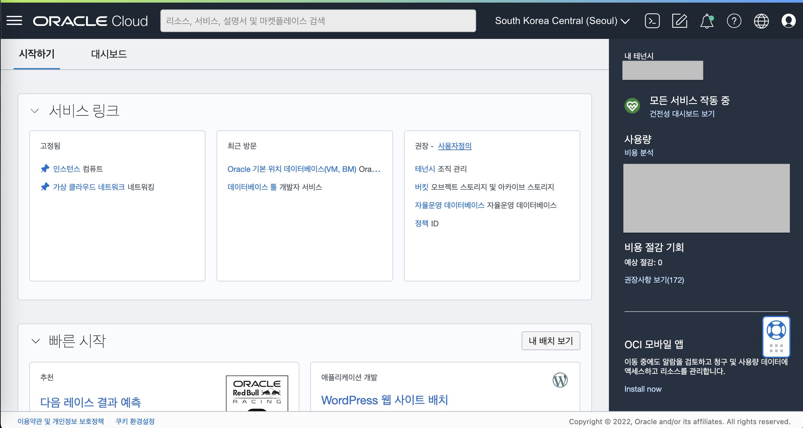

1. Dashboard를 클릭하면 기본적인 사용현황을 살펴볼 수 있습니다.
  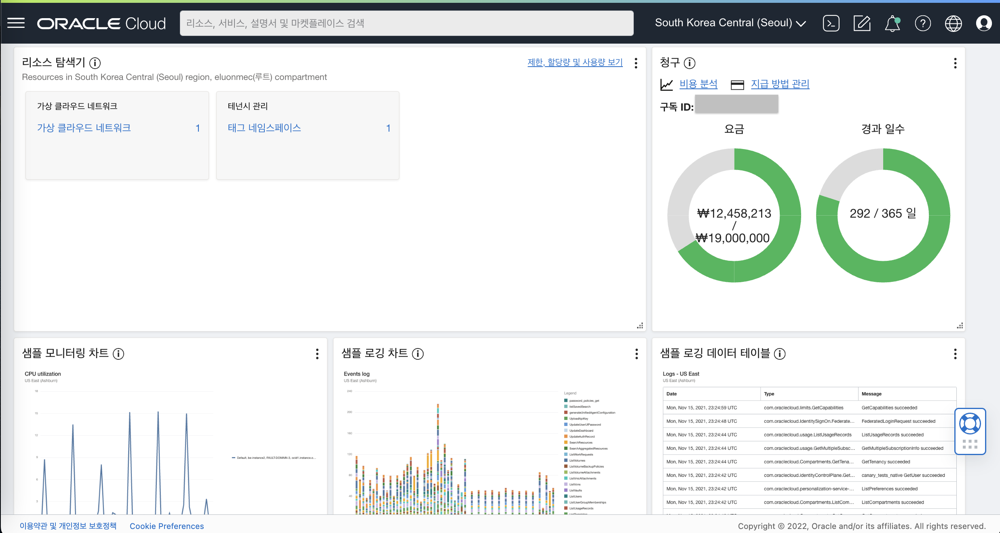

## Task 2: OCI 인프라스트럭처 기본 설정

> **Note**: 화면 언어는 한국어로 설정하고 진행합니다. 언어 변경은 우측 상단의 지구본 모양 **Language** 아이콘을 선택하고 변경할 수 있습니다.

### Compartment 생성

1. 좌측 상단의 **햄버거 아이콘**을 클릭하고, **ID & 보안(Identity & Security)**을 선택한 후 **구획(Compartments)**을 클릭합니다.

   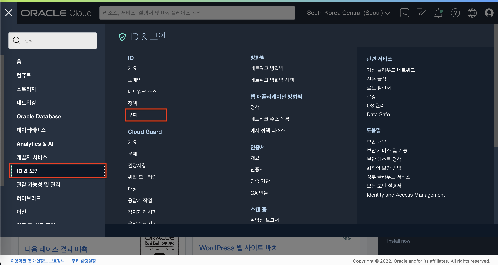

2. 이동한 화면에서 "구획 생성" 버튼을 클릭합니다.
   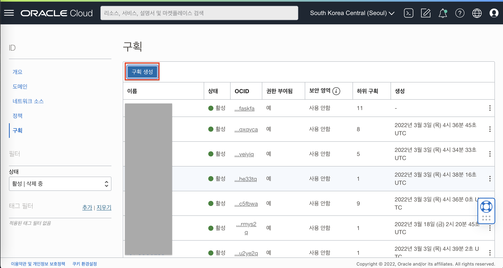
3. 다음과 같이 입력하여 실습 구획을 생성합니다.
   - Name: Enter **oci-basic**
   - Description: **OCI Basic 핸즈온 진행을 위한 구획입니다.**
   - Parent Compartment: **루트 구획 또는 특정 구획 선택**
   - **구획 생성(Create Compartment)** 클릭
   
   

### Virtual Cloud Network 생성

1. 좌측 상단의 **햄버거 아이콘**을 클릭하고, **네트워킹(Networking)**을 선택한 후 **가상 클라우드 네트워크(Virtual Cloud Networks)**를 클릭합니다.

   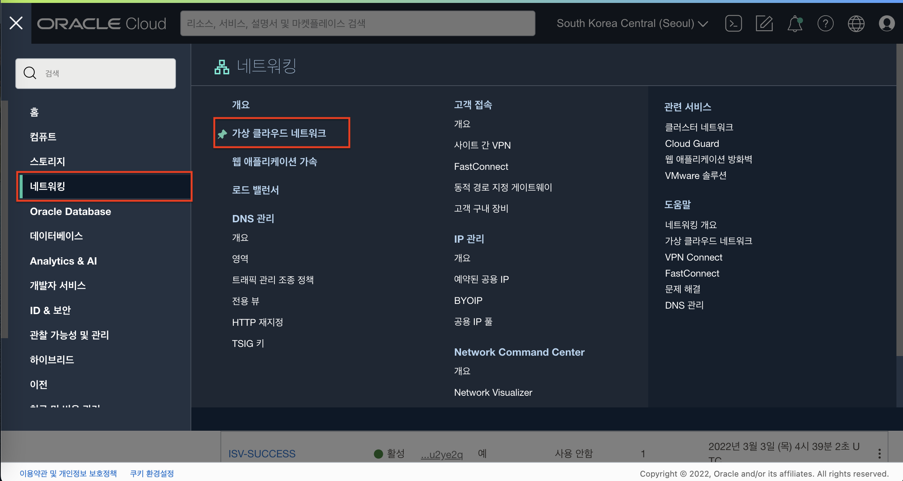

1. 화면 좌측 하단의 구획(Compartment)에서 위에서 생성한 **oci-basic**을 선택합니다.
   
   

1. **VCN 마법사 시작(Start VCN Wizard)**을 클릭합니다.

1. **인터넷 접속을 통한 VCN 생성(Create VCN with Internet Connectivity)**을 선택 후 **VCN 마법사 시작(Start VCN Wizard)**을 클릭합니다.

   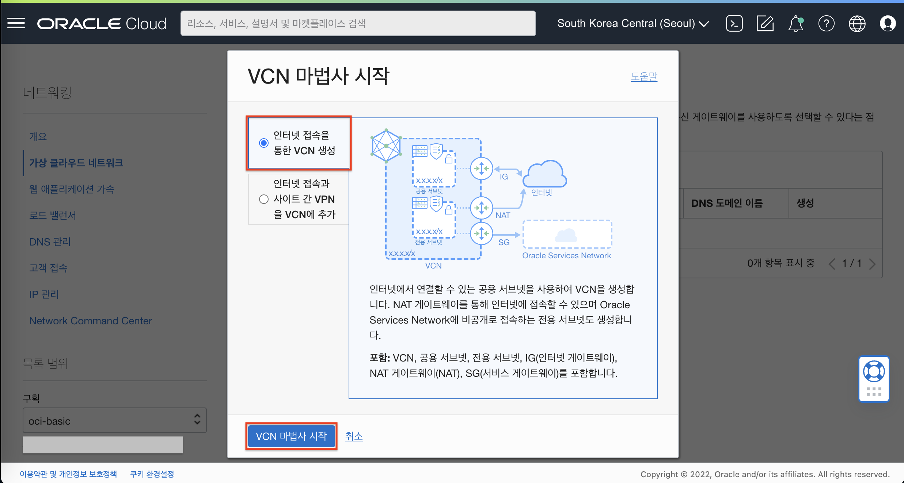

1. 다음과 같이 입력:
      - VCN Name: Enter **vcn-oci-basic**
      - VCN CIDR Block: **10.0.0.0/16** (기본값)
      - Public Subnet CIDR Block: **10.0.0.0/24** (기본값)
      - Private Subnet CIDR Block: **10.0.1.0/24** (기본값)
      - **Next** 클릭
   
   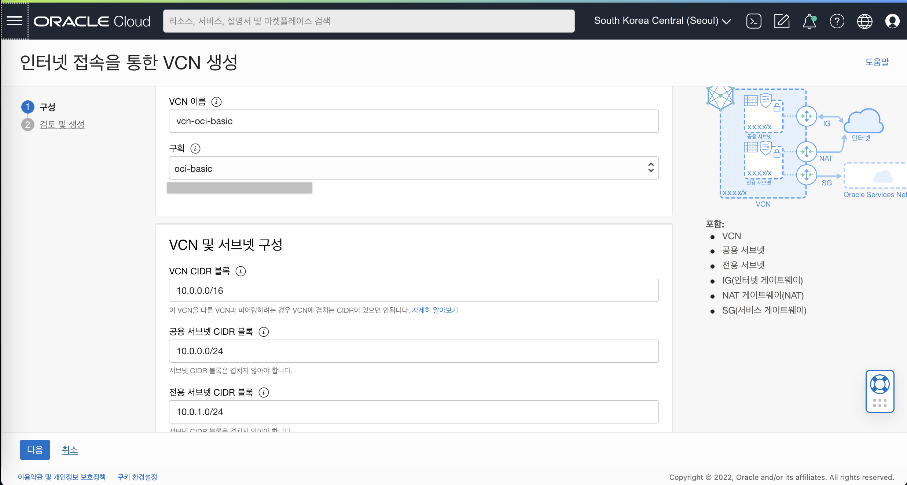

1. 입력된 정보를 확인한 후 하단의 **Create**를 클릭하여 VCN을 생성합니다
   
   
   

### Oracle Database (DBCS) 생성

1. 좌측 상단의 **햄버거 아이콘**을 클릭하고, **Oracle Database**을 선택한 후 **Oracle 기본 위치 데이터베이스(VM,BM)**를 클릭합니다.

   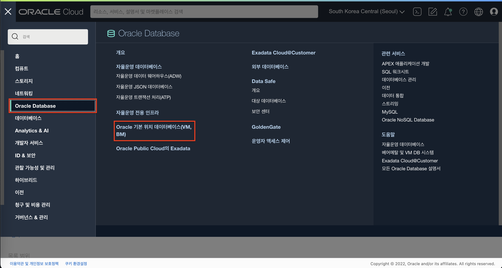

2. 화면 좌측 하단의 구획(Compartment)에서 위에서 생성한 **oci-basic**을 선택합니다.

   

3. **Create DB System** 버튼을 클릭 합니다.
4. DB 시스템에 대한 기본정보에 아래와 같이 입력 및 선택 합니다.
   - 구획 선택: Enter **oci-basic** 을 선택합니다.
   - DB 시스템 이름 지정: **DEMODB**
   - 가용성 도메인 선택: AD-1 (서울 리전의 경우)
   - 구성 유형 선택: **가상 머신**

   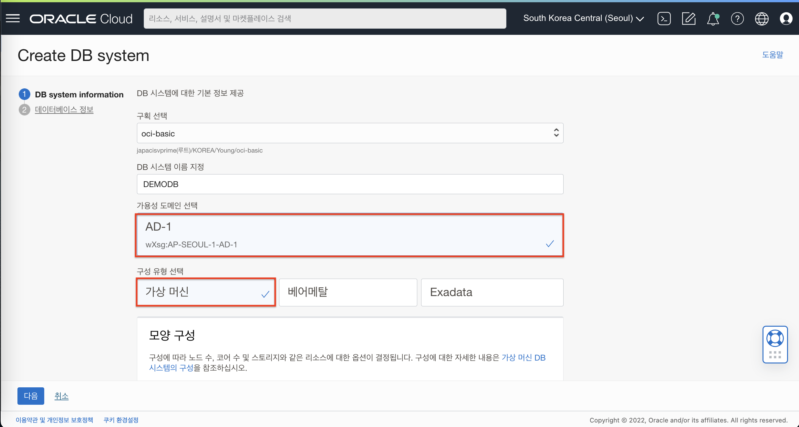

5. 모양 구성 섹션에서 **구성 변경** 버튼을 클릭하여 아래와 같이 구성합니다.
   - 구성 계열: **AMD**
   - 노드당 OCPU 수: **2**
   - **구성 선택** 버튼을 클릭합니다.

   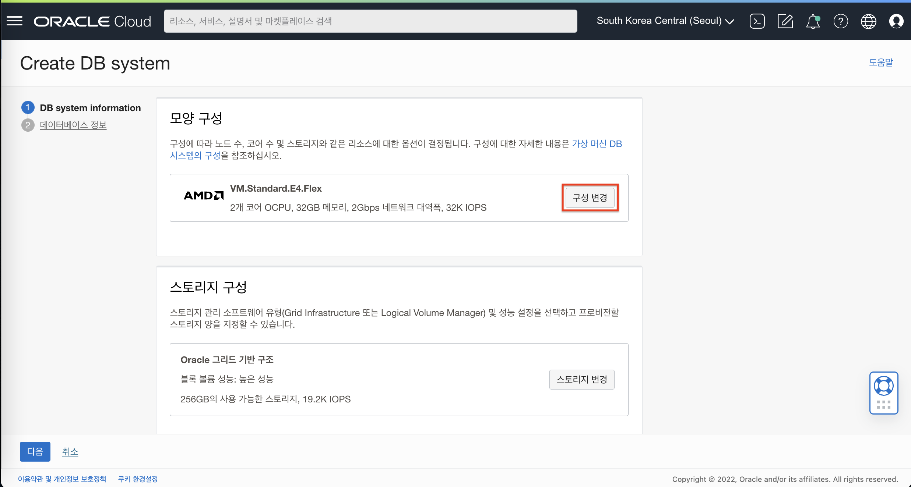
   - AMD로 구성하게 되면 OCPU 개수를 유연하게 선택할 수 있고 메모리와 네트워크 대역폭 IOPS등 성능은 OCPU와 비례적으로 확장됩니다.
     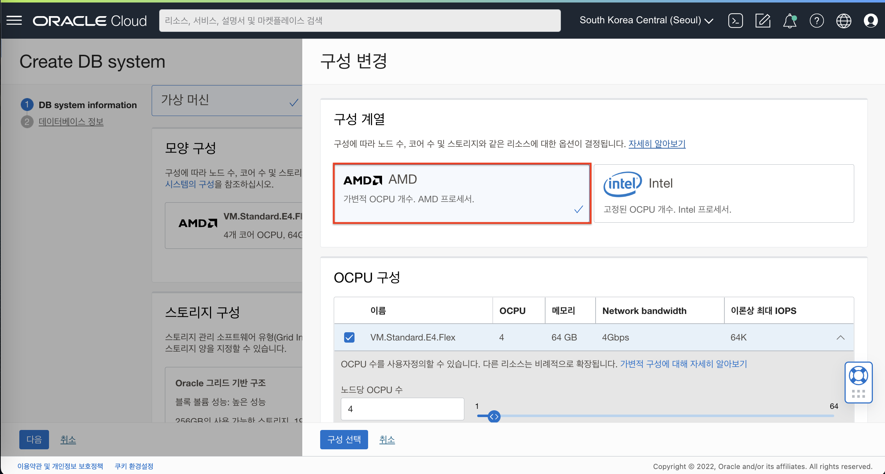
   - Intel로 구성하게 되면 고정된 Shape에서 워크로드 환경에 적합한 사양을 선택하여 구성할 수 있습니다.
     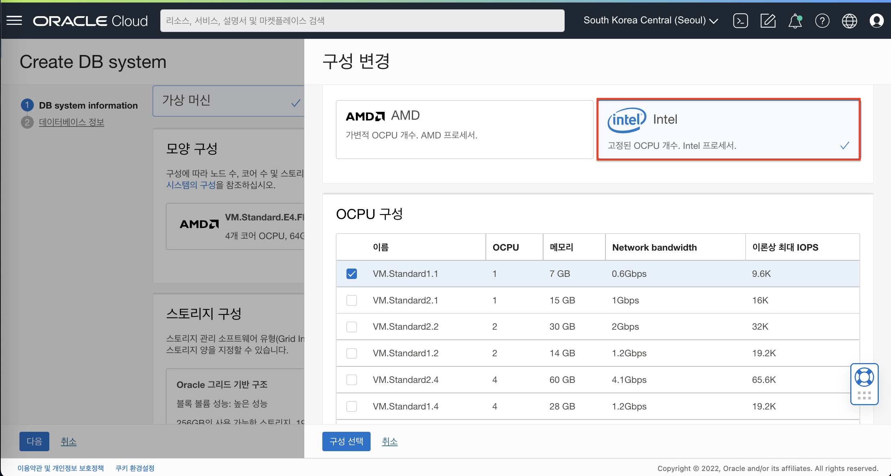

6. 스토리지 구성 설정은 변경하지 않습니다.
7. DB 시스템 구성에 아래와 같이 입력 및 선택 합니다.
   - 총 노드 수: **1**
   - Oracle Database 소프트웨어 에디션: **Standard Edition**

   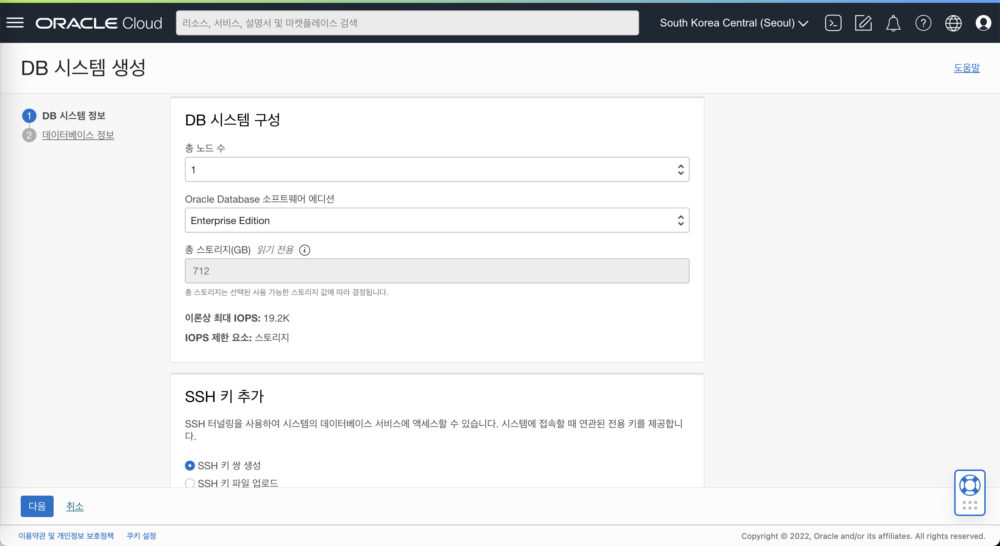

8. SSH 키 추가 섹션에서 신규로 키를 생성하거나 기존 키를 업로드 또는 붙여넣기 합니다.
9. 라이센스 유형 및 네트워크 정보를 아래와 같이 입력 및 선택 합니다.
   - 라이센트 유형 선택: **라이센스 포함됨**
   - 가상 클라우드 네트워크: **vcn-oci-basic**
   - 클라이언트 서브넷: **전용 서브넷-vcn-oci-basic**
   - 호스트 이름 접두어: DEMODB
   - **다음** 버튼을 클릭하여 데이터베이스 정보를 구성합니다.

   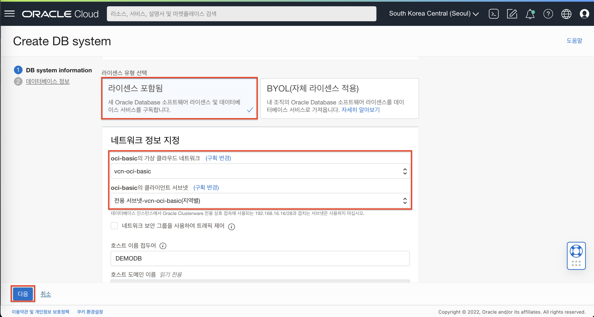

10. 데이터베이스 정보 단계에서 아래와 같이 입력 및 선택 합니다.
    - 데이터베이스 이름 : **DEMODB**
    - 데이터베이스 이미지 : **Oracle Database 19c** (기본값)
    - PDB 이름 : **PDB1**

    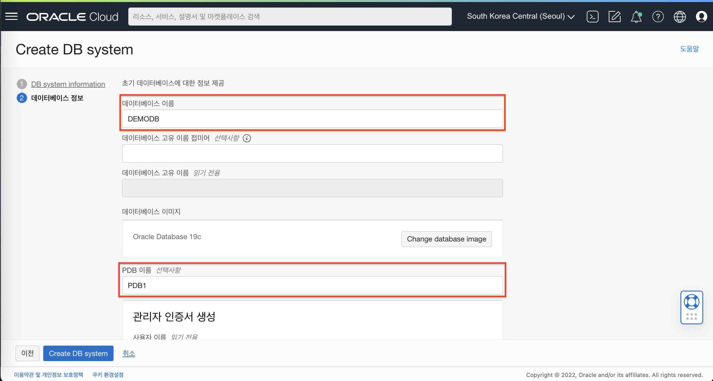

11. 관리자 정보를 다음과 같이 입력합니다.
    - 관리자 비밀번호 규칙: **비밀번호는 9자에서 30자 사이여야 하며 대문자, 소문자, 특수 문자 및 숫자를 각각 두 개 이상 포함해야 합니다. 특수 문자는 _, # 또는 -여야 합니다.**
    - 관리자 비밀번호: **WelCome12##**
    - 데이터베이스 백업 구성: **자동 백업 사용 체크 해제**
    - **Create DB System** 버튼을 클릭하여 DB 시스템 생성
    
    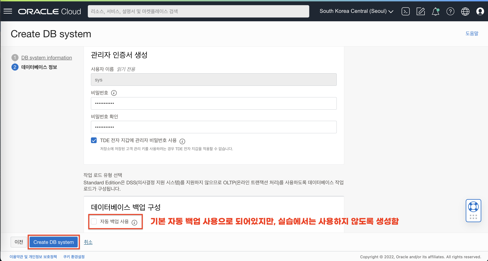

12. DB System이 프로비전되는 동안 다른 실습을 진행합니다.
    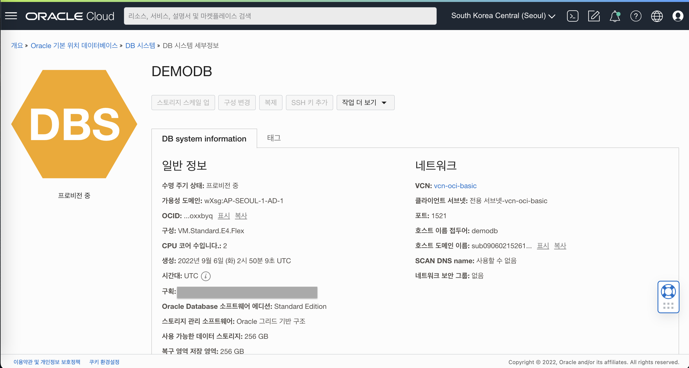

[다음 랩으로 이동](#next)
